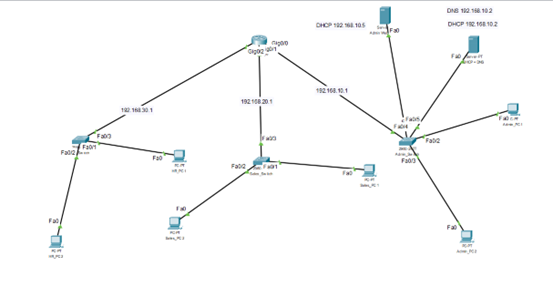
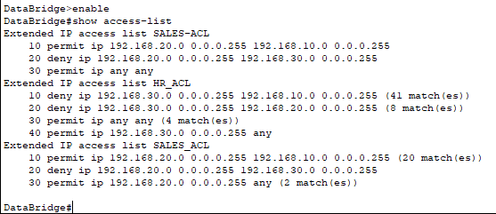
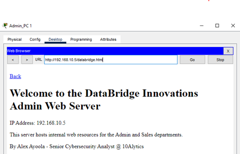
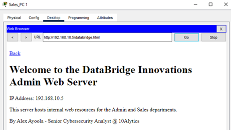
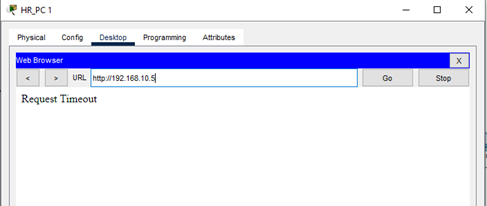

# DataBridge Innovations – Network Security Project

## 🧠 Project Overview
This project demonstrates a secure and segmented enterprise network configuration for **DataBridge Innovations**.  
It includes subnet design, router configuration, ACL implementation, and verification testing.

The objective is to **enforce departmental isolation and network security** through Access Control Lists (ACLs) and controlled web access.

---

## 🌐 Network Design & Topology
The network design connects three departments:
- **Admin Network (192.168.10.0/24)**
- **Sales Network (192.168.20.0/24)**
- **HR Network (192.168.30.0/24)**

Each subnet communicates through a central router. ACLs were applied to restrict unnecessary traffic between departments.

📁 *Refer to the diagram:*  
`Images/network_topology.png`

---

## 🔐 Access Control List (ACL) Configuration
ACLs were configured on the router to control communication between subnets.

### Example CLI Commands
```bash
Router> enable
Router# configure terminal
Router(config)# access-list 10 deny 192.168.30.0 0.0.0.255
Router(config)# access-list 10 permit any
Router(config)# interface fa0/0
Router(config-if)# ip access-group 10 in
Router(config-if)# end
Router# write memory
```
Full configuration is available in:
- `Configs/Router_ACL_Config.txt`
- `Configs/DHCP_Config.txt`
- `Configs/DNS_Config.txt`

---

## 🧪 Testing and Verification
Ping and web tests were performed between departments to verify ACL and network behavior.

| Test Case | Source | Destination | Result |
|------------|----------|--------------|---------|
| Admin → Sales | 192.168.10.10 | 192.168.20.10 | ✅ Successful |
| Admin → HR | 192.168.10.10 | 192.168.30.10 | ❌ Blocked by ACL |
| HR → Web Server | 192.168.30.10 | 192.168.10.5 | ❌ Restricted |
| Sales → Web Server | 192.168.20.10 | 192.168.10.5 | ✅ Allowed |

Screenshots:  
## Network Topology


## Router ACL Configuration


## Access Control Test Results
### Admin Access


### Sales Access


### HR Access



---

## 🧾 Results & Conclusion
- Successfully implemented **inter-departmental network segmentation**.
- Enforced **access restrictions** using Cisco ACLs.
- Validated correct operation of DHCP, DNS, and Web Server services.
- Improved network security posture and compliance readiness.

---

## 👨‍💻 Author
**Alex Ayoola**  
Cybersecurity Analyst | System Analyst | IT Governance & Network Security  
[LinkedIn](https://www.linkedin.com/in/alex-ayoola)

---

© 2025 DataBridge Innovations. All rights reserved.
